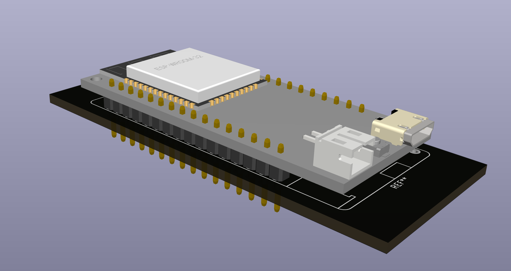

# Lolin32 Footprint

Please note that the 3D model is not the exact same version. However it's close enough in order to be useful in a 3D design.

## Installation

    git submodule add https://github.com/besi/kicad-28byj lib/28byj

## Credits

- Credits for the [original repository](https://github.com/erenfro/kicad-wemos) go to [erenfro](https://github.com/erenfro)

- [3d model](https://grabcad.com/library/lolin-d32-1) by [Frantisek Brabec](https://grabcad.com/frantisek.brabec-1)
